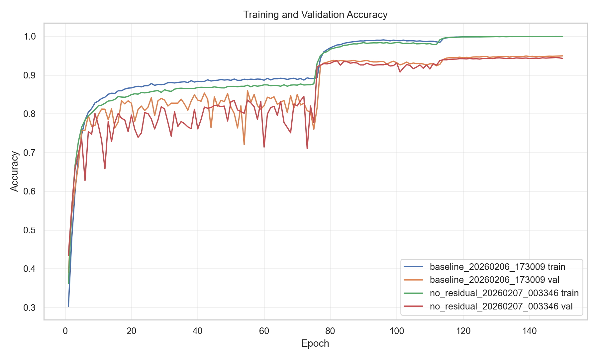
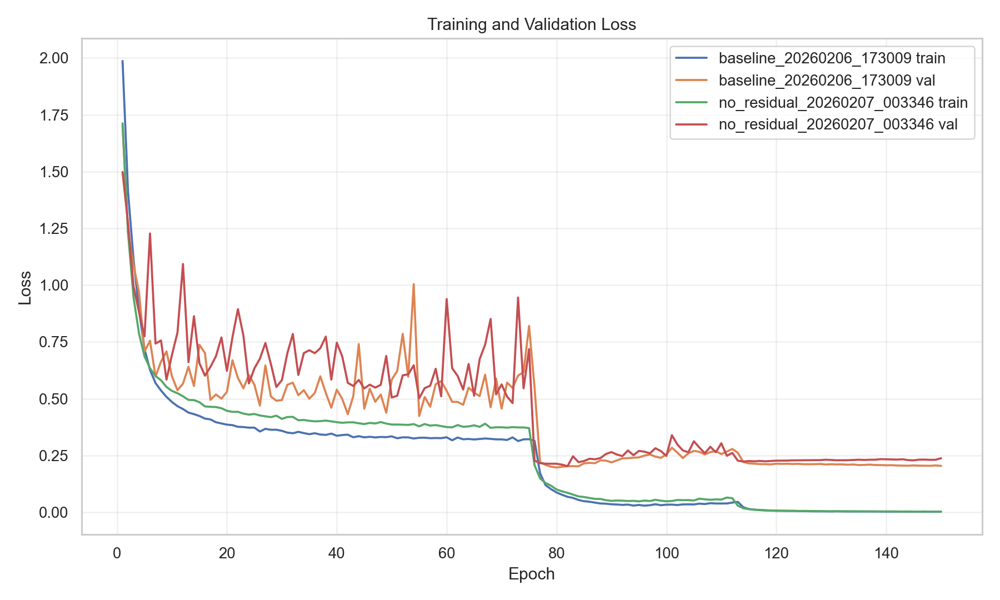

# Initial Experimentation Summary (Baseline vs No-Residual)

Date: 2026-02-08  
Author: Codex + user  
Scope: First end-to-end baseline and residual-ablation runs on CIFAR-10.

## Experiment Setup

- `baseline`: `results/baseline_20260206_173009` (`use_residual: true`)
- `no_residual`: `results/no_residual_20260207_003346` (`use_residual: false`)
- Both runs:
  - Trained for 150 epochs
  - Same seed (`42`)
  - Same optimizer/schedule (SGD, LR milestones `[75, 112]`, gamma `0.1`)
  - Same device backend (`mps`)

## Key Results

| Metric | Baseline | No Residual | Delta (Baseline - NoResidual) |
|---|---:|---:|---:|
| Best val accuracy | 0.9497 (epoch 150) | 0.9453 (epoch 148) | +0.0044 |
| Final val accuracy | 0.9497 | 0.9432 | +0.0065 |
| Final train accuracy | 0.9998 | 0.9997 | +0.0001 |
| Final val loss | 0.2045 | 0.2382 | -0.0337 |
| First epoch with val >= 0.90 | 77 | 76 | -1 epoch |
| First epoch with val >= 0.93 | 78 | 80 | +2 epochs |
| First epoch with val >= 0.94 | 114 | 116 | +2 epochs |

Observations:

- Both models converged to high accuracy.
- Baseline is consistently better in late training, but by a modest margin.
- Biggest practical difference is final calibration/loss rather than raw top-1 accuracy.

## Curves

### Accuracy Curves

### Loss Curves

## Notable Findings

1. The no-residual model performed much better than the initial expectation in `README.md` (which projected a larger gap).
2. The strongest baseline advantage appears in aggregate, not as a dramatic collapse of the no-residual run.
3. After the LR drop at epoch 76, both models improve sharply; baseline keeps a small edge through epoch 150.

## Is Anything Strange?

Nothing indicates an implementation bug from this first pass:

- Metadata confirms the flag difference is real (`use_residual: true` vs `false`).
- Parameter counts were validated equal in tests.
- Both runs completed full schedules and produced stable learning curves.

However, one methodological caveat matters:

- Current training loop evaluates on the CIFAR-10 test split every epoch and uses that signal for `best.pt`.
  - This can make results optimistic and can reduce the credibility of small deltas.
  - A separate validation split from the training data would make comparisons cleaner.

## Paper Context (He et al., 2015)

- The original ResNet paper's strongest "plain net degradation" story is most visible at greater depths.
- This repo's current ablation is ResNet-18 depth, where a plain counterpart can still train to strong CIFAR-10 accuracy.
- So: this result is plausible, but does not reproduce the most dramatic degradation regime from the paper.

## Immediate Takeaway

For this exact setup, residuals help, but the effect size is currently modest (~0.5 to 0.7 points at the end).
The next iteration should focus on tightening evaluation protocol and deepening the ablation if we want a stronger paper-faithful contrast.

